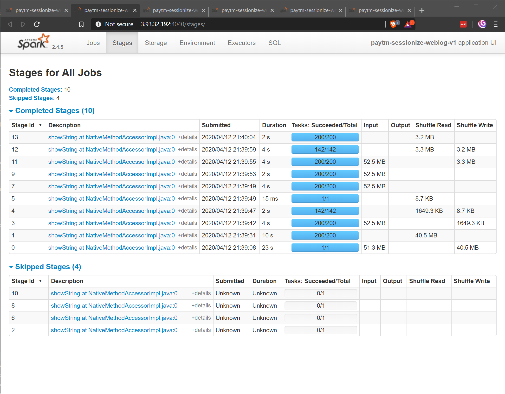

# Paytm Labs Weblog Challenge

  * [Introduction](#introduction)
  * [Results](#results)
    + [Statistics](#statistics)
    + [Responses to the Coding Challenge](#responses-to-the-coding-challenge)
    + [Definition of a Session and Its Length](#definition-of-a-session-and-its-length)
  * [Methodology](#methodology)
    + [Deployment](#deployment)
  * [Discussion](#discussion)

## Introduction

The challenge is to make analytical observations about an AWS Elastic Load Balancer log ([documentation](http://docs.aws.amazon.com/ElasticLoadBalancing/latest/DeveloperGuide/access-log-collection.html#access-log-entry-format)) with the following goals:

1. Sessionize ([Wikipedia Link](https://en.wikipedia.org/wiki/Session_(web_analytics))) the web log by IP with a session time limit of 15 minutes.
2. Determine the average session time
3. Determine unique URL visits per session. To clarify, count a hit to a unique URL only once per session.
4. Find the most engaged users, ie the IPs with the longest session times

## Results

### Statistics

There were 1,158,500 events in the log, with 90,544 distinct IP addresses. 

There were 110,835 putative sessions. 20,291 sessions had only a single request registered within the given session time limit; excluding these, 88,865 sessions were analyzed further.

### Responses to the Coding Challenge

1. The average session time was *2 minutes 6 seconds*. This may change depending on how a session is defined. Please see my discussion below. 

2. The three sessions -- _not_ users -- with the most unique URL visits per session were:

Hits | Client IP
--- | :---: 
9,532 | 52.74.219.71
8,016 | 119.81.61.166
5,790 | 119.81.61.166

3. The three most engaged users were:

Client IP | Maximum duration (s)
--------------- | ----------------:
  119.81.61.166 |             2,069
   52.74.219.71 |             2,069
  106.186.23.95 |             2,069

The console output of the Spark job can be viewed [here](src/results_console.md).

### Definition of a Session and Its Length

There is little consensus on what constitutes a session. In the absence of requirements, I assumed the following:

- A session _must have more than one request_ within the time limit window. This helps avoid a skew in the average session length metric. A different set of analytics may yield better insight into the excluded, single-event "sessions."

- The duration of a session is calculated simply by subtracting the timestamp of the first event from that of the last. Some metrics add a second or two to account for the consumption time of the content served by the last request: if the requirements call for this, it can easily be added.

- The maximum time limit for a session is _inclusive_: that is, the difference between the timestamps of two adjacent events are 15 minutes, this will count as a continuation of a session. However, limits of `unix_timestamp` function introduces up to 1.999999 seconds of uncertainty. Given the difference in magnitude from the session window (900 seconds) I assumed that this was acceptable.

## Methodology

Apache Spark was used to extract the event data from the logs, transform into sessions, and load into memory for analytical queries via PySpark, Python API for Apache Spark. The queries themselves were written in Spark SQL, as it can easily be inspected and maintained by Data Analysts.

Given a small size of weblog data, the ETL was prototyped in Databricks Community Edition [notebook](https://databricks-prod-cloudfront.cloud.databricks.com/public/4027ec902e239c93eaaa8714f173bcfc/5211130610419137/1119682703921521/2408820551392452/latest.html). Subsequently, production candidate code was written and tested on a single `r5.large` Amazon EC2 instance running Python 3.7.6 and stand-alone Spark 2.4.5. 

The total runtime of the [Spark job](src\sessionize.py) was 57 seconds.


### Deployment

On a newly-instantiated Amazon EC2 instance, or a similar (virtual) machine set up with Python 3.7 and PySpark, clone this repo and simply run the Python code:
```bash
python3.7 src/sessionize.py
```

Note: to install Python 3.7.x and PySpark 2.4.5: 
```bash
sudo apt-get install -y python3.7 python3-pip openjdk-8-jdk
sudo update-alternatives --config java  # select OpenJDK 8
python3.7 -m pip install pyspark
```

## Discussion

Leveraging Spark-native code and partitioning the data over client IP address (assumed to be evenly distributed) allowed fast execution of queries with minimal shuffle operation. Looking at the Stages page of Spark UI, only one full shuffle in the beginning took place; the rest of the shuffling operations were much smaller in size to facilitate queries.



Sessions were labelled in the form of `clientIPaddress-number`, e.g. `52.74.219.71-3`. However, universally unique IDs (UUIDs) are typicalled used for this application. Since Spark does not have a native UUID-generating function, user-defined functions (UDFs) are commonly used. However, in Python, even the most trivial UDF can introduce a severe performance bottleneck. Using a less conventional session label allowed for the implemention to be entirely Spark-native.

Spark lacks a Python API for user-defined aggregation functions (UDAFs). UDAFs may have made the session labeling more efficient by combining the aggregation step with the labeling step. I implemented such a vectorized UDF -- the vectorized nature is supposed to improve its efficiency, which may very well be the case if each partition were sufficiently large -- but in this case, the execution was very slow, with queries lasting well over 10 minutes for the first one alone. Ultimately, this approach was discarded in favour of a Spark-native strategy. That said, I'll leave this here for future discussion:

```python
from uuid import uuid4

import pandas as pd
from pyspark.sql.functions import pandas_udf, PandasUDFType
from pyspark.sql.types import StructType, StructField, StringType, TimestampType


session_schema = StructType([
    StructField("ts_utc", TimestampType(), nullable=False),
    StructField("client_ip", StringType(), nullable=False),
    StructField("request_url", StringType(), nullable=True),
    StructField("session_id", StringType(), nullable=False),
])

@pandas_udf(session_schema, PandasUDFType.GROUPED_MAP)
def get_session_id(pdf):
    session_length = pd.Timedelta(15, 'm')
    pdf["session_no"] = (pdf.ts_utc - pdf.ts_utc.shift(1) > session_length).cumsum() + 1
    to_uuid = {i: str(uuid4()) for i in pdf["session_no"].unique()}
    pdf["session_id"] = pdf.session_no.map(to_uuid)
    return pdf[["ts_utc", "client_ip", "request_url", "session_id"]]
```
